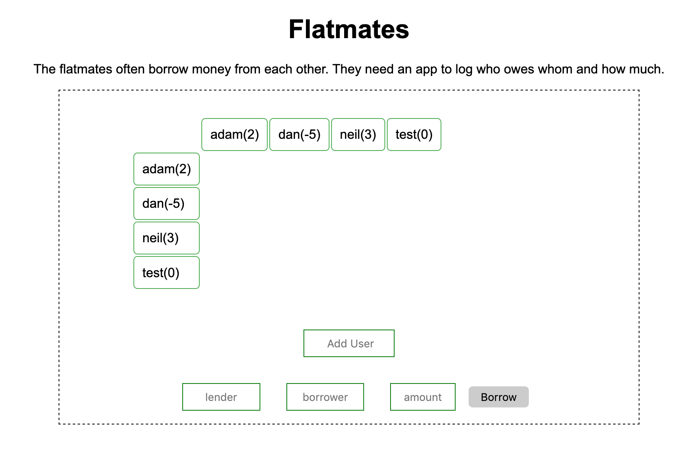

# About

I built this application to introduce the React framework to my backend dev colleagues. I used Python and Flask to create the backend service API. 

### Scenario:
```
The flatmates often borrow money from each other. They need an app to log who owes whom and how much.
```

The project name comes from a BBC drama on iPlayer now.

The front page provides a simple user interface for listing, adding users with balances and a form to lend money.



# API specification

#### User object

```json
{
  "name": "adam",
  "owes": {
    "chris": 4.0
  },
  "owed_by": {
    "bob": 6.5,
    "dan": 2.75
  },
  "balance": 5.25
}
```

#### Methods

| Description    | HTTP Method | URL                         | Payload Format                                                            | Response w/o Payload         | Response w/ Payload                                                             |
| -------------- | ----------- | --------------------------- | ------------------------------------------------------------------------- | ---------------------------- | ------------------------------------------------------------------------------- |
| List all users | GET         | /api/users                  | N/A                                                                       | `<all users>`                |
| List a user    | GET         | /api/user?name=`<username>` | N/A                                                                       | `<User object for the user>` |
| Create user    | POST        | /api/add                    | `{"user":<name of new user (unique)>}`                                    | N/A                          | `<User object for new user>`                                                    |
| Create borrow  | POST        | /api/borrow                   | `{"lender":<name of lender>,"borrower":<name of borrower>,"amount":5.25}` | N/A                          | `{"users":<updated User objects for <lender> and <borrower> (sorted by name)>}` |

## Test

## Run

```
npm install
pipenv install
npm run dev
python3 server.py
```
navigate to http://localhost:3000 in a browser

## Todo
the table shows the amount owed between every two persons.

lenders and borrowers should be a drop down list of users.

add user should validate if the user already exists and user name length and patterns. 

unit tests for front and backend.

add search user back. select user from a list, highlight the row/col of the table for the selected users. By default All is selected and no highlights in the table.


